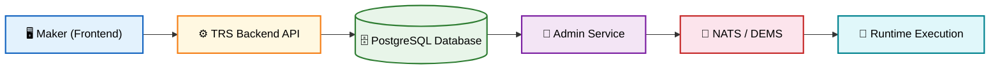

# Tazama Rule Studio (TRS)

Tazama Rule Studio (TRS) is a comprehensive design-time rule management platform that enables financial institutions to create, validate, test, and deploy transaction monitoring rules without writing code manually. TRS serves as the bridge between business logic requirements and runtime execution by providing a full-stack solution — a visual node-based rule builder for flow definition and code generation, combined with a robust backend API for lifecycle management, simulation, and deployment orchestration.

**What TRS is:**
- A design-time rule management platform for creating and managing transaction processing rules within the Tazama ecosystem
- A visual node-based rule builder with drag-and-drop flow editing, automatic TypeScript code generation, and real-time validation
- A test case generation system for creating rule test harnesses directly from the visual interface
- A simulation sandbox supporting both rule-only (NATS) and end-to-end (DEMS-driven) execution modes
- A lifecycle management system with maker-checker-deployer workflow for rule artifacts
- A multi-tenant platform with role-based access control (Maker, Checker, Deployer)
- An audit logging system tracking all rule changes, status transitions, and workflow events
- An ISO 20022 message parsing and validation engine

## Architecture

### High-Level Flow



---

## Quick Start

### Prerequisites

- Node.js 22+ (LTS recommended)
- npm 9+
- PostgreSQL 15+
- Keycloak (for authentication via Tazama Auth Service)
- Docker & Docker Compose (for containerized setup)

### 1. Clone the Repository

```bash
git clone https://github.com/tazama-lf/rule-studio.git
cd rule-studio
```

### 2. Frontend Setup

```bash
cd frontend
npm install

# Create environment file
cp .env.example .env

# Configure API endpoints in .env
# Key variables:
# - VITE_API_URL (backend API)
# - VITE_SANDBOX_API_URL (sandbox service)
# - VITE_NATS_API_URL (NATS publisher)
# - VITE_DEMS_ENDPOINT (DEMS engine)
# - VITE_ADMIN_ENDPOINT (admin service)

# Start development server
npm run dev
# Frontend available at http://localhost:5174
```

### 3. Backend Setup

```bash
cd ../backend
npm install

# Create environment file
cp .env.example .env

# Configure database and services in .env
# Key variables:
# - POSTGRES_HOST, POSTGRES_PORT, POSTGRES_DB
# - TAZAMA_AUTH_URL, AUTH_PUBLIC_KEY_PATH
# - ADMIN_SERVICE_URL
# - SMTP_HOST, SMTP_PORT (for email notifications)

# Start development server
npm run start:dev
# Backend API available at http://localhost:3005
# Swagger docs at http://localhost:3005/api/docs
```

### 4. Docker Compose Setup (Database)

```bash
# From root directory, start PostgreSQL
docker-compose up -d

# This starts:
# - PostgreSQL 15 (port 5432)
# - Initializes database tables from database/init/
```

---

## Project Structure

### Root Directory

```
rule-studio/
├── frontend/                             # React 19 frontend application
│   ├── src/
│   │   ├── pages/                       # Application pages
│   │   │   ├── Auth/                    # Login page
│   │   │   ├── Home/                    # Rules list & management
│   │   │   ├── RuleEditor/             # Rule metadata & workflow tabs
│   │   │   │   ├── Overview/           # Rule details & status
│   │   │   │   ├── History/            # Audit trail
│   │   │   │   ├── Parser/             # ISO 20022 message viewer
│   │   │   │   ├── RuleBuilder/        # Visual flow editor tab
│   │   │   │   ├── TestCases/          # Test case builder tab
│   │   │   │   └── Simulation/         # Simulation sandbox
│   │   │   ├── rule-builder/           # Full-screen visual rule builder
│   │   │   └── test-case-generate/     # Full-screen test case generator
│   │   ├── components/                  # Reusable UI components
│   │   │   ├── RuleBuilder/            # Visual builder components
│   │   │   │   ├── Canvas/            # Flow editor canvas
│   │   │   │   ├── LeftSidebar/       # Node palette
│   │   │   │   ├── RightSidebar/      # Node properties panel
│   │   │   │   ├── NestedCanvas/      # Sub-flow editor
│   │   │   │   ├── OutputModal/       # Code generation output
│   │   │   │   └── Header/            # Builder actions
│   │   │   ├── Modals/                 # Dialog components
│   │   │   ├── JsonFormatter/          # JSON display & editing
│   │   │   └── ...                     # Button, Input, Table, etc.
│   │   ├── redux/                       # State management
│   │   │   ├── Api/                    # RTK Query API services
│   │   │   │   ├── Auth/              # Authentication API
│   │   │   │   ├── Rules/             # Rule CRUD API
│   │   │   │   ├── Config/            # Transaction config API
│   │   │   │   ├── Rule-builder/      # Flow & node operations API
│   │   │   │   ├── Nats/              # NATS simulation API
│   │   │   │   ├── Simulation/        # Sandbox service API
│   │   │   │   ├── SimulationLogs/    # Simulation logs API
│   │   │   │   └── Parse/             # ISO message parsing API
│   │   │   └── store.ts               # Redux store configuration
│   │   ├── contexts/                    # React contexts
│   │   │   ├── ModalContext/           # Global modal state
│   │   │   └── TabContext/             # Tab navigation state
│   │   ├── hooks/                       # Custom React hooks
│   │   │   └── RuleBuilder/            # Builder-specific hooks
│   │   ├── layout/                      # App layout components
│   │   ├── routes/                      # Route configuration
│   │   ├── utils/                       # Utilities & helpers
│   │   │   ├── Common/                 # Storage, helpers, enums
│   │   │   ├── Constants/              # App constants & claims
│   │   │   ├── Flow/                   # Flow transformers & code generator
│   │   │   └── Theme/                  # MUI theme configuration
│   │   └── validation/                  # Yup schemas & validation context
│   ├── __tests__/                       # Test files
│   ├── Dockerfile
│   ├── package.json
│   └── vite.config.ts
│
├── backend/                              # NestJS backend application
│   ├── src/
│   │   ├── services/
│   │   │   ├── auth/                    # Authentication & login
│   │   │   ├── rules/                   # Rule CRUD & management
│   │   │   ├── config/                  # Transaction configuration
│   │   │   ├── nodes/                   # Node management
│   │   │   ├── parse-extract/           # ISO 20022 parsing & validation
│   │   │   ├── notification/            # Email notifications
│   │   │   └── simulation-logs/         # Simulation log management
│   │   ├── guards/                      # Authorization guards
│   │   ├── decorators/                  # Custom decorators (auth, audit, swagger)
│   │   ├── interceptors/                # Audit interceptor
│   │   ├── constants/                   # Application constants
│   │   ├── utils/                       # Utilities & RBAC
│   │   │   └── rbac/                   # Permission matrix & RBAC service
│   │   ├── logger-service/              # Logging integration
│   │   ├── audit/                       # Audit module
│   │   ├── app.module.ts               # Root module
│   │   └── main.ts                     # Entry point
│   ├── test/                            # E2E & unit tests
│   ├── Dockerfile
│   ├── package.json
│   └── tsconfig.json
│
├── database/
│   └── init/
│       └── 01-create-tables.sql         # Database initialization
│
├── docker-compose.yml                    # PostgreSQL setup
├── README.md                             # This file
└── LICENSE
```

---

## Development Commands

### Frontend Commands (from `frontend/`)

```bash
# Development
npm run dev              # Start dev server (http://localhost:5174)
npm run build            # Build for production
npm run preview          # Preview prod build locally

# Testing
npm run test             # Run all tests
npm run test:watch       # Watch mode
npm run test:coverage    # Coverage report

# Linting
npm run lint             # ESLint check
```

### Backend Commands (from `backend/`)

```bash
# Development
npm run start            # Start application
npm run start:dev        # Start with watch mode
npm run start:debug      # Start with debugging
npm run start:prod       # Production mode

# Building
npm run build            # Compile TypeScript to JavaScript

# Testing
npm run test             # Run unit tests
npm run test:watch       # Watch mode
npm run test:cov         # Coverage report
npm run test:debug       # Debug mode
npm run test:e2e         # End-to-end tests

# Linting & Formatting
npm run lint             # Lint + format check
npm run lint:eslint      # ESLint only
npm run lint:prettier    # Prettier check
npm run fix              # Auto-fix all issues
npm run format           # Format code
```

---

## Testing

### Frontend Testing

- **Unit Tests**: Jest-based component, hook, and Redux API service testing
- **Integration Tests**: RTK Query API service testing with mocked base queries
- **Coverage**: Targeted coverage for pages, hooks, and API modules
- **Tools**: Jest, React Testing Library, ts-jest

```bash
npm run test             # All tests
npm run test:watch       # Watch mode
npm run test:coverage    # Coverage report
```

### Backend Testing

- **Unit Tests**: Jest-based service and controller testing
- **E2E Tests**: Full application endpoint testing
- **Test Database**: Separate test database configuration
- **Tools**: Jest, Supertest

```bash
npm run test             # Unit tests
npm run test:watch       # Watch mode
npm run test:cov         # Coverage report
npm run test:e2e         # End-to-end tests
```

---

## Deployment

### Environment Variables

#### Frontend (`.env`)

```bash
# API Configuration
VITE_API_URL=http://localhost:3005
VITE_SANDBOX_API_URL=http://localhost:3050
VITE_NATS_API_URL=http://localhost:4000
VITE_DEMS_ENDPOINT=http://localhost:3002/dems-engine
VITE_ADMIN_ENDPOINT=http://localhost:5100
VITE_SIMULATION_ENDPOINT=http://localhost:5000/v1/evaluate/iso20022/pacs.002.001.12

# Application
VITE_APP_NAME=Tazama Rule Studio
VITE_APP_VERSION=0.0.1
VITE_CRYPTO_KEY=your-crypto-key
```

#### Backend (`.env`)

```bash
# Environment Configuration
NODE_ENV=development
MAX_CPU=2
FUNCTION_NAME=your-service-name
PORT=3000

# Authentication Service
TAZAMA_AUTH_URL=http://localhost:3000/v1/auth
AUTH_PUBLIC_KEY_PATH=path/to/public-key.pem
CERT_PATH_PUBLIC=path/to/public-key.pem

# Admin Service
ADMIN_SERVICE_URL=http://localhost:3001

# OpenSearch Configuration
OPENSEARCH_NODE=http://localhost:9200
OPENSEARCH_SSL_REJECT_UNAUTHORIZED=false
OPENSEARCH_USERNAME=your-username
OPENSEARCH_PASSWORD=your-password

# CORS
ALLOWED_ORIGINS=*

# Security Keys 
CRYPTO_SECRET_KEY=your-secret-key
ENCRYPTION_KEY=your-encryption-key
IV_LENGTH=your-16-char-iv

# SMTP Configuration (Email Notifications)
SMTP_HOST=smtp.example.com
SMTP_PORT=587
SMTP_SECURE=false
SMTP_USER=your-email@example.com
SMTP_PASS=your-email-password
SMTP_FROM_EMAIL=your-email@example.com
SMTP_FROM_NAME="Your App Name"
```

### Docker Deployment

#### Frontend Only

```bash
cd frontend
docker build -t trs-frontend:latest .
docker run -p 5174:5174 trs-frontend:latest
```

#### Backend Only

```bash
cd backend
docker build -t trs-backend:latest .
docker run -p 3005:3005 --env-file .env trs-backend:latest
```

#### Full Stack with Docker Compose

```bash
# Start PostgreSQL from root directory
docker-compose up -d

# View logs
docker-compose logs -f

# Stop services
docker-compose down
```

---

## Security

### Frontend Security

- **JWT Authentication**: Token-based auth with secure localStorage
- **Role-Based Routes**: Route protection based on user roles
- **Input Validation**: Yup schema validation on all forms
- **Encrypted Storage**: Sensitive data encrypted with crypto-js before storage

### Backend Security

- **JWT Validation**: Signature verification using Keycloak public key via Tazama Auth Service
- **Role-Based Access Control (RBAC)**: Three roles — `Maker`, `Checker`, `Deployer`
- **Three-Tier Permission Model**: Role assignment → status-based access → status transitions
- **Authorization Guards**: NestJS guards for endpoint protection with custom decorators (`@RequireEditorRole()`, `@RequireApproverRole()`, `@RequirePublisherRole()`)
- **Tenant Isolation**: Complete multi-tenant data separation via `tenant_id`
- **Input Sanitization**: Request validation at controller level
- **Audit Logging**: Comprehensive change tracking via audit interceptor (fire-and-forget pattern)
- **Encryption**: Password and sensitive data encryption

---

## Features

### Visual Rule Builder

- **Drag-and-Drop Canvas**: Node-based flow editor using @xyflow/react
- **Node Palette**: Categorized nodes for functions, conditions, and data operations
- **Properties Panel**: Inline node configuration with real-time updates
- **Nested Flows**: Sub-flow support for complex rule logic
- **Code Generation**: Automatic TypeScript code generation from visual flows
- **Code Validation**: Syntax checking and validation error display
- **Flow Persistence**: Save and load rule flows with version tracking

### Test Case Generation

- **Visual Test Builder**: Same node-based interface as rule builder
- **Global Variables**: Auto-populated from rule definitions
- **Separate Category**: Independent flow tracking (`test_case_generation`)
- **View-Only Mode**: Read-only access for reviewers

### Simulation Sandbox

- **Rule-Only Simulation**: Execute rules in isolation via NATS publisher
- **End-to-End Simulation (DEMS-driven)**: Full transaction evaluation through DEMS engine
- **End Report**: Fetch and display detailed reports by message ID
- **Simulation Logs**: Record and retrieve simulation execution history
- **Payload Editor**: Edit JSON payloads with syntax highlighting

### Rule Lifecycle Management

- **Create & Clone**: Create new rules or clone existing ones with versioning
- **ISO 20022 Support**: Transaction type/version selection (pain.001, pacs.002, etc.)
- **Status Workflow**: In Progress → Under Review → Approved → Deployed → Active/Inactive
- **Metadata Tracking**: Track sync, test, deploy, and simulation states per rule

### Role-Based Workflows

- **Maker**: Create, edit, build rules, run simulations, and submit for review
- **Checker**: Review rules, approve or reject with comments
- **Deployer**: Deploy approved rules to production and manage activation state

### Configuration Management

- **Transaction Types**: Manage ISO 20022 transaction type definitions
- **Version Management**: Track and select transaction type versions
- **Sample Payloads**: Retrieve payload templates for simulation

### Audit & Notifications

- **Audit Trail**: Complete history of all rule modifications with timestamps
- **Email Notifications**: Automated notifications on status changes via SMTP
- **Comments**: Approval/rejection comments displayed in rule history

---

## Technology Stack

### Frontend

- **React 19** — Modern UI framework
- **TypeScript** — Type-safe development
- **Vite 7** — Fast build tool and dev server
- **Material UI (MUI) 7** — Component library
- **Redux Toolkit 2** — State management with RTK Query for API calls
- **@xyflow/react 12** — Node-based visual flow editor
- **React Hook Form + Yup** — Form management and validation
- **@monaco-editor/react** — Code editor for payload editing
- **Framer Motion** — Animations
- **React Router 7** — Client-side routing
- **crypto-js** — Client-side encryption
- **Jest + React Testing Library** — Testing frameworks

### Backend

- **NestJS 11** — Node.js framework
- **TypeScript** — Type-safe development
- **PostgreSQL 15** — Primary database
- **@nestjs/swagger** — API documentation (Swagger UI)
- **@nestjs/axios** — HTTP client for external services
- **@tazama-lf/auth-lib** — Authentication library
- **@tazama-lf/audit-lib** — Audit logging library
- **@tazama-lf/frms-coe-lib** — FRMS COE logging service
- **AJV** — JSON schema validation for ISO 20022 messages
- **Nodemailer** — Email notifications
- **crypto-js** — Server-side encryption
- **jsonwebtoken** — JWT handling
- **Jest + Supertest** — Testing frameworks

### Infrastructure

- **Docker** — Containerization
- **Docker Compose** — Multi-container orchestration
- **PostgreSQL 15** — Relational database
- **Node.js 22** — Runtime
- **Keycloak** — Identity provider (external)
- **NATS** — Message broker (external)
- **DEMS** — Dynamic Event Monitoring Service (external)

---

## Support

For support and questions:

- Create an issue in the [GitHub repository](https://github.com/tazama-lf/rule-studio)
- Review existing issues and pull requests
- Check environment configuration and database connectivity
- Enable debug logging for troubleshooting
- Consult the API documentation at `/api/docs` (Swagger UI)
